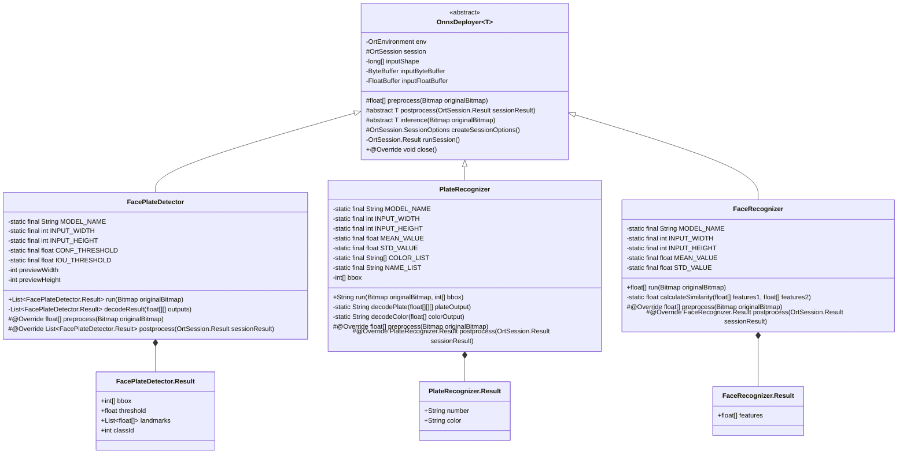

# Android ONNXRuntime 部署说明(Java版本)

## 一、功能介绍

代码结构:

```text
model
├── base
│   └── OnnxDeployer.java       # onnx抽象基类
├── FacePlateDetector.java      # 人脸+车牌检测派生类
├── FaceRecognizer.java         # 人脸识别派生类
├── PlateRecognizer.java        # 车牌识别派生类
└── util
    └── ModelImageHelper.java   # 图像处理工具类
```

继承体系:



## 二、使用方法

### 1.将本仓库初始化为你的Android项目的submodule

```sh
cd project/app/src/main/java/com/example # 放在应用包的同级目录下，以便不同项目的package语句保持一致
git submodule add git@gitee.com:Jjiabainong/algo-faceplate-onnx.git model
cd model
git checkout android
```

### 2.配置gradle依赖

```kts
dependencies {
    implementation(libs.onnxruntime.android)
}
```

```toml
[versions]
onnxruntime = "1.23.1"

[libraries]
onnxruntime-android = { group = "com.microsoft.onnxruntime", name = "onnxruntime-android", version.ref = "onnxruntime" }
```

或者包名+版本号合并声明

```kts
dependencies {
    implementation("com.microsoft.onnxruntime:onnxruntime-android:1.23.1")
}
```

### 3.模型文件放置于assets目录

模型文件路径(Linux格式): smb://192.168.2.28/产研中心/算法/faceplate/model-onnx/

```text
app/src/main
├── AndroidManifest.xml
└── assets
    ├── car_face_det.onnx
    ├── car_rec.onnx
    └── face_rec.onnx
```

### 4.部署代码(以人脸识别为例)

```java
// 导入包
import com.example.model.*;
public class Recognizer implements AutoCloseable {
    // 模型实例
    private final FaceRecognizer faceRecognizer;
    // 初始化
    public Recognizer(Context context) {
        faceRecognizer = new FaceRecognizer(context);
    }
    // 释放资源
    @Override
    public void close() {
        faceRecognizer.close();
    }
    // 检测
    private void run(Bitmap bitmap) {
        float[] features = faceRecognizer.run(bitmap);
        Log.d(TAG, Arrays.toString(features));
        bitmap.recycle();
    }
}
```

## 三、注意事项

模型推理时间较长，要在独立的线程中运行run方法，避免阻塞主线程
输入的Bitmap图像要求为RGB格式
